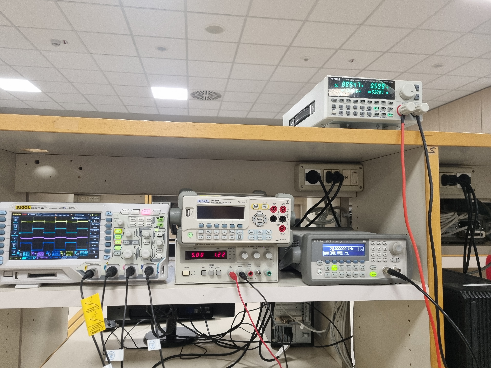
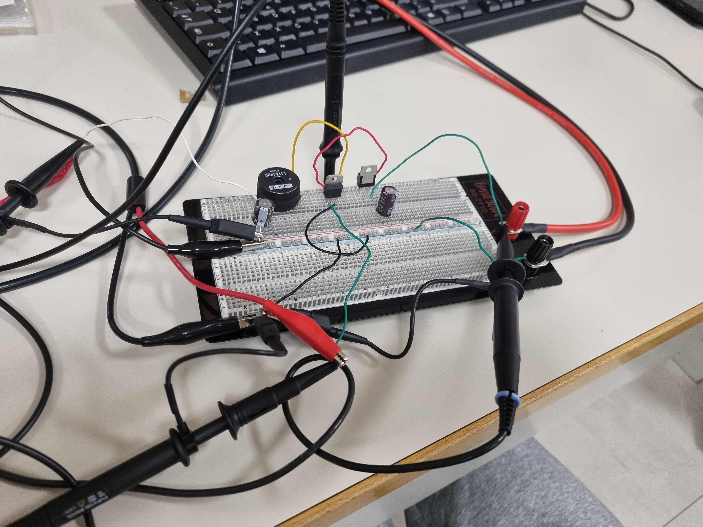
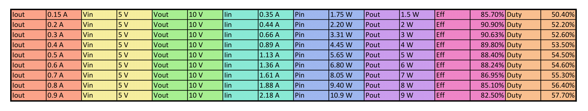
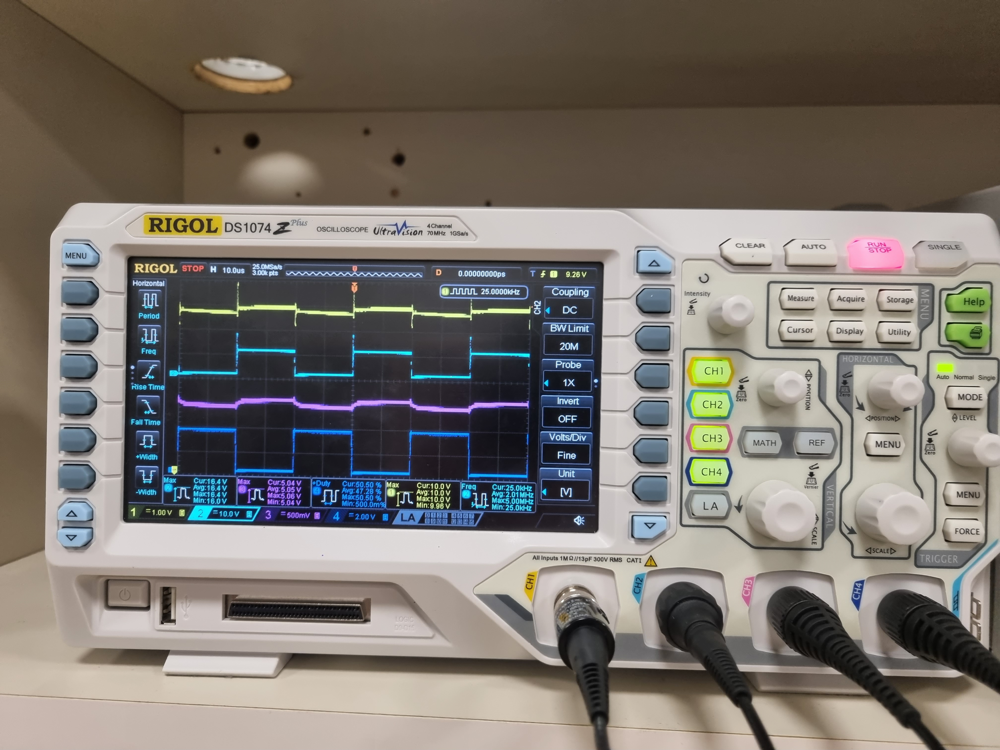

# ⚡ DC-DC Boost Converter: Design, Simulation, and Implementation

**Course:** Power Electronics Laboratory  
**University:** University of Bologna, Cesena Campus  
**Academic Year:** 2023/2024  

---

## 📌 Project Overview

This repository contains the complete documentation, **LTspice simulation files**, and analysis for a **DC-DC Boost Converter** project. The work covers the full development cycle: from **theoretical sizing** to **simulation** and **practical implementation** on a breadboard.

**Project Objectives**

1.  Regulate an input voltage of **$V_{in} = 5 V$** to a stable output voltage of **$V_{o} = 10 V$**.
2.  Optimize efficiency across a dynamic load range.
3.  Minimize switching noise and transients via a custom-designed **RC Snubber**.

**Design Specifications:**

| Parameter                            | Value         | Notes                                                   |
| :----------------------------------- | :------------ | :------------------------------------------------------ |
| **Input Voltage** ($V_{in}$)         | $5 V$         | Base supply voltage                                     |
| **Output Voltage** ($V_{o}$)         | $10 V$        | Target voltage regulated via duty cycle                 |
| **Switching Frequency** ($f_{sw}$)   | $25 kHz$      | Operating frequency in Continuous Conduction Mode (CCM) |
| **Inductance** ($L$)                 | $150 \ \mu H$ | Ensures CCM                                             |
| **Output Current Range** ($I_{out}$) | $0 A - 0.9 A$ | Dynamic load conditions                                 |

The full laboratory report with calculations and analysis can be found here:
➡️ **[Download Boost Converter Project Report (EN)](Boost_Converter_Project_Report.pdf)**

---

## 🛠️ Tools and Software Used

### Laboratory Instrumentation

The following professional instruments were employed for circuit testing and characterization:





* **Bench Power Supply:** Provides stable input voltage.
* **Function Generator:** Generates MOSFET gate drive signals.
* **Electronic Load:** Allows efficiency analysis under variable loads.
* **Digital Oscilloscope:** Monitors output ripple, switching node transients, and signal integrity.

### Software

* **LTspice:** For component sizing, simulation, and snubber analysis.
* **LaTeX:** For professional technical report preparation.

---

## 📊 Key Operational Results

### Circuit Assembly and Probing

The final circuit was assembled on a breadboard. Special attention was given to **probe placement** and minimizing parasitic inductances on the switching node.





### Efficiency Analysis

Efficiency ($E_{ff}$) was measured across the output current range. **Results:**

* **Peak Efficiency:** $E_{ff}$ ≈ 91\% at $I_{out} = 0.2 A$.
* **Efficiency Drop:** Observed at high loads ($I_{out} \approx 0.9 A$) due to conduction and switching losses.





### Signal Integrity and RC Snubber Efficacy

The RC Snubber ($R_{SNB} = 16 \ \Omega$, $C_{SNB} = 0.66 \ nF$) effectively reduced ringing on the switching node.





Signals measured (as shown in the oscilloscope capture above):  
- **Input Voltage**: <span style="color:purple;">$V_{in}$ (purple)  
- **Output Voltage**: <span style="color:gold;">$V_{o}$ (yellow)  
- **Switching Node Voltage**: <span style="color:deepskyblue;">$V_{sw}$ (cyan/light blue)  
- **MOSFET Gate Drive**: <span style="color:blue;">$V_{gate}$ (blue)

---

## 🗂️ Repository Structure

```
DC-DC-Boost-Converter-Design/
│
├─ Boost_Converter_Project_Report.pdf      # Final technical report
├─ LICENSE                                 # MIT License
├─ README.md                               # This file
├─ Simulations/
│   ├─ Boost_Converter.asc                 # Boost Converter schematic
│   ├─ Boost_Converter_With_Snubber.asc    # Boost Converter with RC Snubber
│   └─ Components/
│       ├─ 1400series.lib
│       ├─ MBR760.txt
│       └─ stp16nf06l.lib
└─ Images/
    ├─ Circuit_on_Breadboard.jpg
    ├─ Laboratory_Instrumentation.jpg
    ├─ Measured_Data_Table.png
    └─ Oscilloscope_Signals.jpg
```

* `Boost_Converter.asc` → Base circuit for sizing and CCM verification
* `Boost_Converter_With_Snubber.asc` → Includes RC Snubber for transient suppression
* `Components/` → Custom library files for non-ideal component modeling

---

## 📜 License

* **Source Code and Simulation Files:** MIT License
* **Technical Report and Documentation:** CC BY 4.0 (Creative Commons Attribution 4.0 International)
